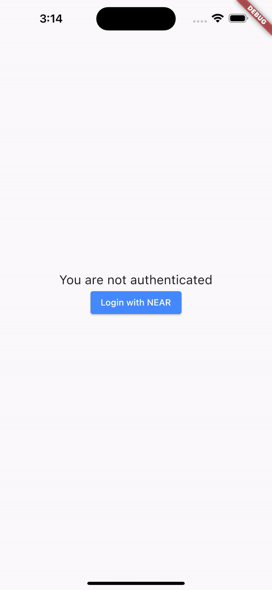

<!-- PROJECT LOGO -->
<br />
<div align="center">
  <h2 align="center">Near Protocol | Flutter authentication</h2>

  <p align="center">
    A working example of authentication using Flutter and Near Protocol with redirection to a NEAR wallet
    <br />
    <br />
    <a href="https://github.com/nearuaguild"> Explore other examples</a>
    ·
    <a href="https://github.com/okhomin/flutter_near_auth/issues">Report Bug</a>
  </p>
</div>

## Developed by


**Near Ukrainians Guild** is a fast-growing guild based in Ukraine, aimed at providing high-quality educational content and assistance to grow a strong community of developers/entrepreneurs within the Near Protocol ecosystem

[![Twitter][twitter]][twitter-url]
[![Youtube][youtube]][youtube-url]
[![Telegram Chat][telegram-chat]][telegram-chat-url]
[![Telegram Channel][telegram-channel]][telegram-channel-url]
[![Medium][medium]][medium-url]
[![Github][github]][github-url]

---

<!-- Demo -->

## Demo



<!-- ABOUT THE PROJECT -->

## About The Project

This example covers the process of implementing authentication using Flutter and NEAR Protocol and validating all the data on the backend side.

> **If you're not familiar with Flutter & Golang, read these resources before following further**:
> * https://flutter.dev/
> * https://go.dev/

The Flutter client uses a NEAR wallet to add a public key to the account.  
The backend side validates the data making RPC requests to a [NEAR RPC provider](https://docs.near.org/api/rpc/providers).

### Built With

- [![Javascript][javascript]][javascript-url]
- [![Flutter][flutter]][flutter-url]
- [![Golang][golang]][golang-url]

---

<!-- GETTING STARTED -->

## Getting Started

💡 _Before you begin, make sure you have the following installed_

- [golang](https://go.dev/dl/)
- [Flutter](https://docs.flutter.dev/get-started/install)
- [Git](https://git-scm.com/book/en/v2/Getting-Started-Installing-Git/)

### Prerequisites

Follow these simple instructions to setup the required dependencies before usage

1. Clone the repo
   ```sh
   git clone https://github.com/okhomin/flutter_near_auth
   ```
2. Add platform related files to the flutter project
   ```sh
   cd client && flutter create --platforms=ios,android .
   ```
   Remove ios or android if you want to use only one platform. For example:
   ```sh
   cd client && flutter create --platforms=android .
   ```
---

<!-- USAGE EXAMPLES -->

## Usage

> Keep in mind you need to replace `walletUrl` and `contractId` with the `NEAR wallet` you want to use and with the `contract id` of your application in the [index.html](./backend/index.html#L9-L10) file.
```javascript
const walletUrl = 'https://wallet.testnet.near.org/';
const contractId = 'auth.coatyworld1.testnet';
```
> You need to replace `nearEndpoint` and `contractID` with the [`NEAR RPC provider`](https://docs.near.org/api/rpc/providers) you want to use and with the `contract id` of your application in the [main.go](./backend/cmd/main.go#L15-L18) file.
```go
package main

const (
	nearEndpoint = "https://rpc.testnet.near.org"
	contractID   = "auth.coatyworld1.testnet"
)
```
> You need to replace configuration constants in the Flutter client depending on your domain, path, and redirect urls in the [main.dart](./client/lib/main.dart#L112-L116) file.
```dart
static const String _backendHost = 'localhost:8080';
static const String _failureURL = 'client://failure';
static const String _successURL = 'client://success';
static const String _nearLoginPath = '/near/index.html';
static const String _backendAuthPath = '/auth';
```

### Running Backend
[`main.go`](./backend/cmd/main.go) contains the backend logic that is responsible for the validation process of the data received from the Flutter client.
Also, it contains the logic of serving the [`HTML file`](./backend/index.html) that is used for redirection to the NEAR wallet.  
The server will be available at `localhost:8080` by default. If you want to change the port, you need to change the [`main.go`](./backend/cmd/main.go#L108) file.

```sh
cd backend
go run cmd/main.go
```

### Running Flutter client
> Don't forget to generate platform related files and run the backend before running the Flutter client.

[`main.dart`](./client/lib/main.dart) contains the Flutter client logic that is responsible for the authentication process.
To run the client you must have a connected device or emulator. But you may have to replace `localhost` with your local IP address in the [`main.dart`](./client/lib/main.dart#L112) file if you want to run the client on a real device.

```sh
cd client
flutter run
```

## License

Distributed under the MIT License. See [`LICENSE`](./LICENSE) for more information.

<!-- MARKDOWN LINKS & IMAGES -->
<!-- https://www.markdownguide.org/basic-syntax/#reference-style-links -->

<!-- Built with -->

[javascript]: https://img.shields.io/badge/javascript-000000?style=for-the-badge&logo=javascript&logoColor=F7E018
[javascript-url]: https://developer.mozilla.org/en-US/docs/Web/JavaScript
[golang]: https://img.shields.io/badge/Go-00ADD8?style=for-the-badge&logo=go&logoColor=white
[golang-url]: https://go.dev/
[flutter]: https://img.shields.io/badge/Flutter-02569B?style=for-the-badge&logo=flutter&logoColor=white
[flutter-url]: https://flutter.dev/

<!-- Socials -->

[twitter]: https://img.shields.io/badge/news-1DA1F2?style=for-the-badge&logo=twitter&logoColor=white
[youtube]: https://img.shields.io/badge/broadcasting-282828?style=for-the-badge&logo=youtube&logoColor=ff0000
[medium]: https://img.shields.io/badge/articles-202020?style=for-the-badge&logo=medium&logoColor=ffffff
[telegram-chat]: https://img.shields.io/badge/chat-229ED9?style=for-the-badge&logo=telegram&logoColor=white
[telegram-channel]: https://img.shields.io/badge/channel-229ED9?style=for-the-badge&logo=telegram&logoColor=white
[github]: https://img.shields.io/badge/code-000000?style=for-the-badge&logo=github&logoColor=ffffff
[twitter-url]: https://twitter.com/nearuaguild
[youtube-url]: https://www.youtube.com/@nearprotocolukraineguild4064
[medium-url]: https://medium.com/near-protocol-ua
[telegram-chat-url]: https://t.me/nearprotocolua
[telegram-channel-url]: https://t.me/nearprotocoluachannel
[github-url]: https://github.com/nearuaguild